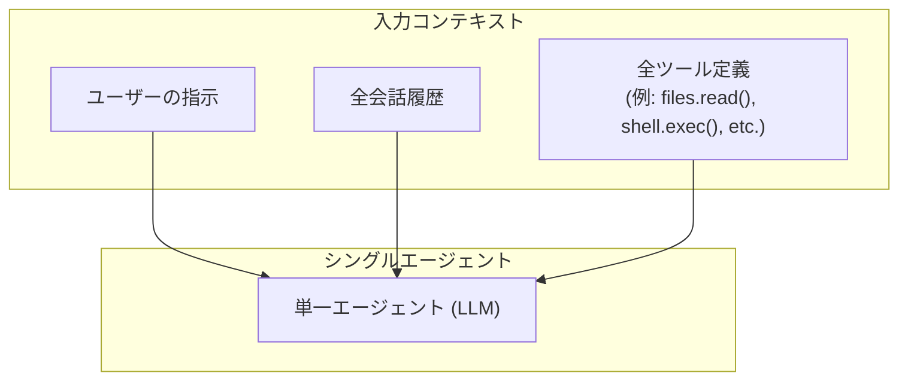
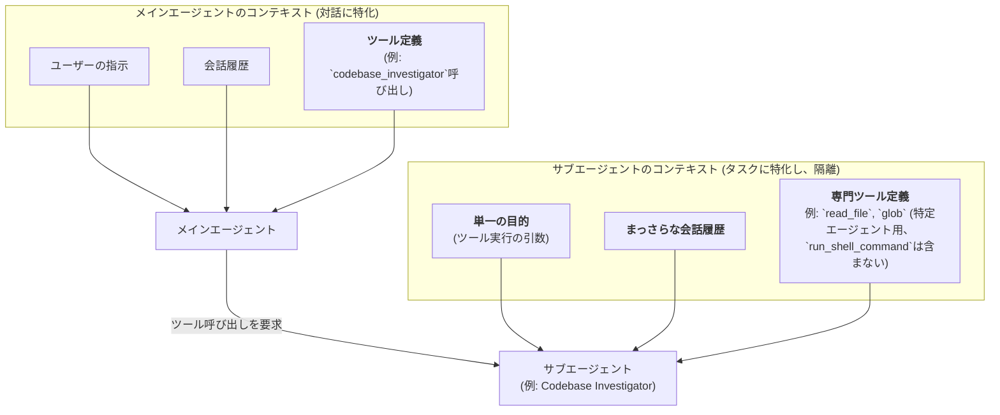
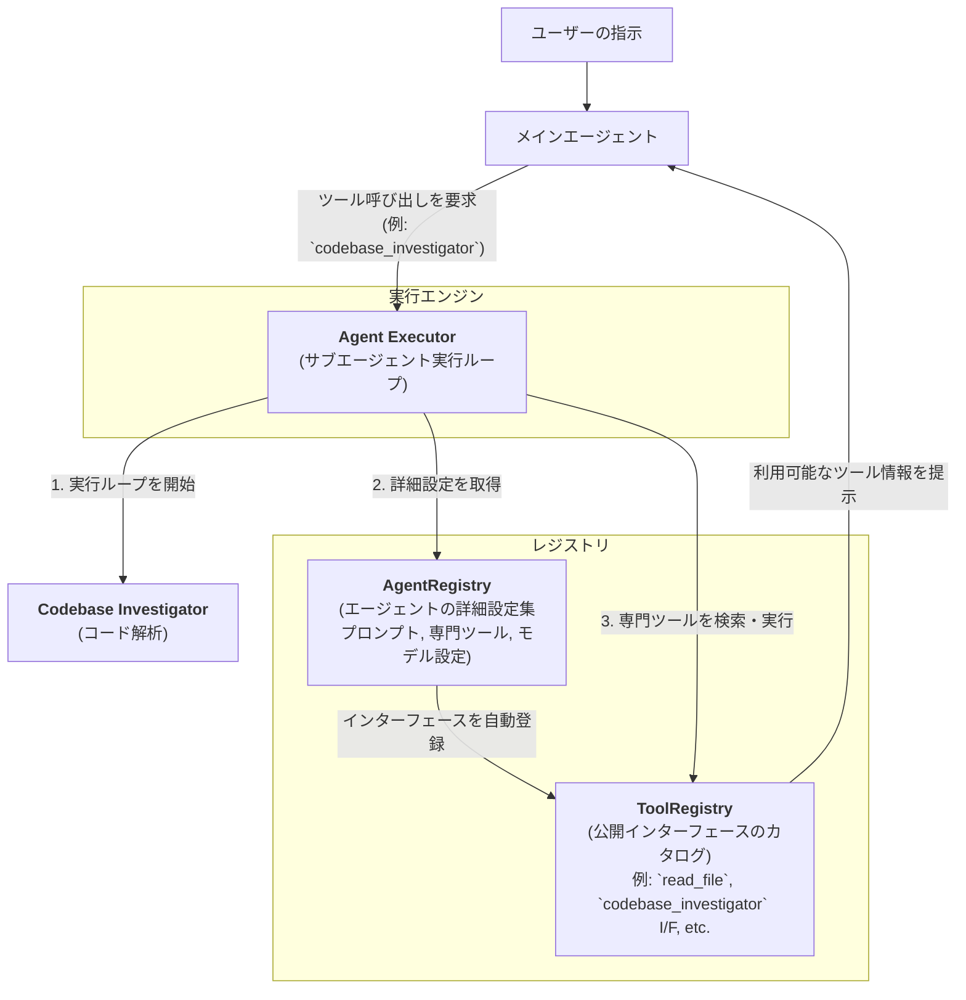

# Gemini CLIに学ぶマルチAIエージェント設計

#### 1. はじめに

AIエージェントシステムを設計する上で、重要な目標として挙げられるのが「エージェントの精度」と「システムの保守性・拡張性」です。本発表では、Gemini CLIのマルチエージェントアーキテクチャが、いかにこの2つの**主要な目標**を達成しているかを探ります。

*   **2つの主要なテーマ**:
    1.  **エージェントの精度**: サブエージェント活用によるコンテキスト最適化によるLLMの能力最大化。
    2.  **システムの保守性・拡張性**: レジストリパターンによる疎結合なアーキテクチャ。

---

#### 2. シングルエージェントの限界

まず、シングルエージェントモデルがこれらの目標達成をいかに阻害するかを見ていきます。

*   **エージェント精度の課題**: 単一の対話インスタンスが全てのツールを管理するため、LLMへのリクエストごとに、利用可能な全てのツールの定義（`FunctionDeclaration`）と会話履歴をコンテキストに含める必要があり、「コンテキストの肥大化」が生じます。
    *   **結果**: LLMの推論能力が低下し、タスクの精度に悪影響を与えます。

*   **保守性・拡張性の課題**: 全ての責務が一つのエージェントに集中するため、コードベースが複雑化し、新しい機能の追加や既存の変更が困難になります。
    *   **結果**: 密結合なアーキテクチャとなり、システムの保守性や拡張性が低下します。



---

#### 3. エージェントの精度向上：役割分離とコンテキスト最適化

シングルエージェントでは全ての情報が一つのコンテキストに集中し、肥大化を招いていました。それに対し、Gemini CLIでは**エージェントの役割を分離し、それぞれに最適化されたコンテキストを与える**ことで、LLMの推論能力を引き出すことを目指します。



この仕組みにより、各エージェントは自身のタスクに集中できる、最適化された環境で動作します。

*   **メインエージェントの責務：対話の進行管理、タスクの分解と委任、結果報告の統合**
    *   **コンテキスト**: ユーザーとの会話履歴全体と、サブエージェントを呼び出すための**単一のツールインターフェース（名前、目的、引数のみを定義した`FunctionDeclaration`、例: `codebase_investigator(objective)`）**のみを管理します。サブエージェント化により、`Codebase Investigator`が内部で行うような調査タスクに必要となる`glob`や`search_file_content`といった**多数の専門ツールの詳細な定義**や、調査タスクを遂行するための**長いシステムプロンプト**は、メインエージェントのコンテキストから取り除かれます。これにより、メインエージェントは詳細な内部実装（プロンプトや専門ツールなど）から切り離されており、その推論負荷は劇的に軽減され、より高レベルなタスクの分解と委任に集中できるようになります。
    *   **役割**: ユーザーとの対話を円滑に進め、複雑なタスクを特定した際には、それを解決できるサブエージェントをツールとして呼び出すことに集中します。サブエージェントからの構造化レポート(`ToolResult`)を受け取り、それを元にユーザーへの最終応答を生成することで、結果報告を統合する役割も担います。

*   **サブエージェントの責務：コンテキストの隔離と専門化**
    *   **コンテキスト**: メインエージェントから渡された**単一の目的**と、**タスク遂行に特化した専門ツール**、そして**まっさらな会話履歴**という、最小限のコンテキストで動作します。メインエージェントのコンテキストからは隔離されています。
    *   **役割**: 独立した環境で、自身の専門知識（システムプロンプト）と専門ツールを駆使してタスクの分析・実行に集中し、最終的な成果物（構造化レポート）を生成することに特化します。

#### 4. システムの保守性・拡張性向上：レジストリによるコンテキスト分離の実現

前のセクションで解説したコンテキスト分離は、「2段階のレジストリパターン」によって実現されます。このパターンは、システムの保守性と拡張性を高めることを目的としています。

前のセクションで解説したコンテキスト分離は、以下のコンポーネント群の連携によって実現されています。この章では、各エージェントの内部コンテキストの図示を抽象化し、システム全体のアーキテクチャと実行フローに焦点を当てます。



*   **`ToolRegistry`と`AgentRegistry`（レジストリ）**: `ToolRegistry`は、`read_file`のようなシンプルなツールや、サブエージェントのラッパー（例: `codebase_investigator`）など、利用可能なすべてのツールの公開インターフェースを保持する汎用カタログです。サブエージェントの完全な定義（本体）は`AgentRegistry`に登録され、その軽量なインターフェースのみが`ToolRegistry`に公開されます。これにより、メインエージェントはサブエージェントの詳細な実装から分離されます。

    *   **インターフェースの例 (`ToolRegistry`に登録される内容)**:
        ```json
        {
          "name": "codebase_investigator",
          "description": "コードベースに関する複雑な質問に、自律的な調査を行って回答する専門家エージェント。",
          "parameters": {
            "type": "OBJECT",
            "properties": {
              "objective": {
                "type": "STRING",
                "description": "調査の目的。達成すべきゴールを明確に記述してください。"
              }
            },
            "required": ["objective"]
          }
        }
        ```

    *   **内部定義の例 (`AgentRegistry`に登録される内容)**:
        ```typescript
        {
          // 上記のインターフェース定義 (name, description, parameters)
          ...
          // エージェントの思考の指針となるシステムプロンプト
          systemPrompt: "あなたはコードベース調査の専門家です。...",

          // 使用するモデルやその設定
          modelConfig: {
            model: "gemini-1.5-pro-latest",
            temp: 0.1
          },

          // 実行時の制約（タイムアウトや最大ステップ数）
          runConfig: {
            max_time_minutes: 5,
            max_turns: 10
          },

          // このエージェントだけが利用できる専門ツールのリスト
          toolConfig: {
            tools: [
              "read_file",
              "list_directory",
              "search_file_content",
              "glob"
            ]
          }
        }
        ```

*   **`Agent Executor`**: メインエージェントからのツール呼び出し（例: `codebase_investigator`）をトリガーとして起動されます。起動後、`AgentRegistry`から自身の詳細設定（プロンプト、利用可能な専門ツールなど）を取得し、`Codebase Investigator`のようなサブエージェントの自律的な実行ループを開始・管理します。ループの内部では、必要に応じて`ToolRegistry`を参照し、専門ツールを実行します。

*   **`ToolRegistry`と`AgentRegistry`（レジストリ）**: `ToolRegistry`は、`read_file`のようなシンプルなツールや、サブエージェントのラッパー（例: `codebase_investigator`）など、利用可能なすべてのツールの公開インターフェースを保持する汎用カタログです。サブエージェントの完全な定義（本体）は`AgentRegistry`に登録され、その軽量なインターフェースのみが`ToolRegistry`に公開されます。これにより、メインエージェントはサブエージェントの詳細な実装から分離されます。

*   **疎結合による保守性・拡張性の実現**:
    *   **保守性**: サブエージェントの内部実装（`AgentRegistry`内の定義）を修正しても、`ToolRegistry`を介して公開されるインターフェースが変わらない限り、メインエージェントには影響がありません。
    *   **拡張性**: 新しいサブエージェントを追加する際は、`AgentRegistry`に定義を追加するだけで、自動的に`ToolRegistry`へインターフェースが登録されるため、安全かつ容易にシステムを拡張できます。

---

#### 5. まとめ：マルチエージェント設計の原則と実践

Gemini CLIのアーキテクチャは、高性能で保守性の高いマルチエージェントシステムを設計する上で、重要な**原則**と、それを実現するための具体的な**実践**を示しています。

1.  **原則：コンテキストの最適化による精度向上**
    *   **学び**: エージェントは、その役割に特化した最小限のコンテキストで動作させるべきである。
    *   **実践**: メインエージェントは対話管理に集中させ、複雑なタスクは専門のサブエージェントに委任する。サブエージェントは、隔離された環境で、単一の目的、専用ツール、クリーンな履歴のみを与えられて動作する。

2.  **原則：関心の分離による保守性向上**
    *   **学び**: エージェントの「使い方（インターフェース）」と「作り方（実装）」は明確に分離すべきである。
    *   **実践**: 「`AgentRegistry`（実装を管理）」と「`ToolRegistry`（インターフェースを管理）」の2段階レジストリパターンを採用する。これにより、エージェント間の依存関係を疎結合に保ち、安全な機能追加や変更を可能にする。

これらの原則と実践を適用することで、エージェントの精度とシステムの保守性・拡張性という、AIシステム開発における2つの主要な目標を両立することが可能になります。

---
#### 参考コード
*   [`packages/core/src/core/geminiChat.ts`](packages/core/src/core/geminiChat.ts)
*   [`packages/core/src/agents/registry.ts`](packages/core/src/agents/registry.ts)
*   [`packages/core/src/tools/tool-registry.ts`](packages/core/src/tools/tool-registry.ts)
*   [`packages/core/src/agents/executor.ts`](packages/core/src/agents/executor.ts)
*   [`packages/core/src/agents/codebase-investigator.ts`](packages/core/src/agents/codebase-investigator.ts)
*   [`packages/core/src/agents/subagent-tool-wrapper.ts`](packages/core/src/agents/subagent-tool-wrapper.ts)